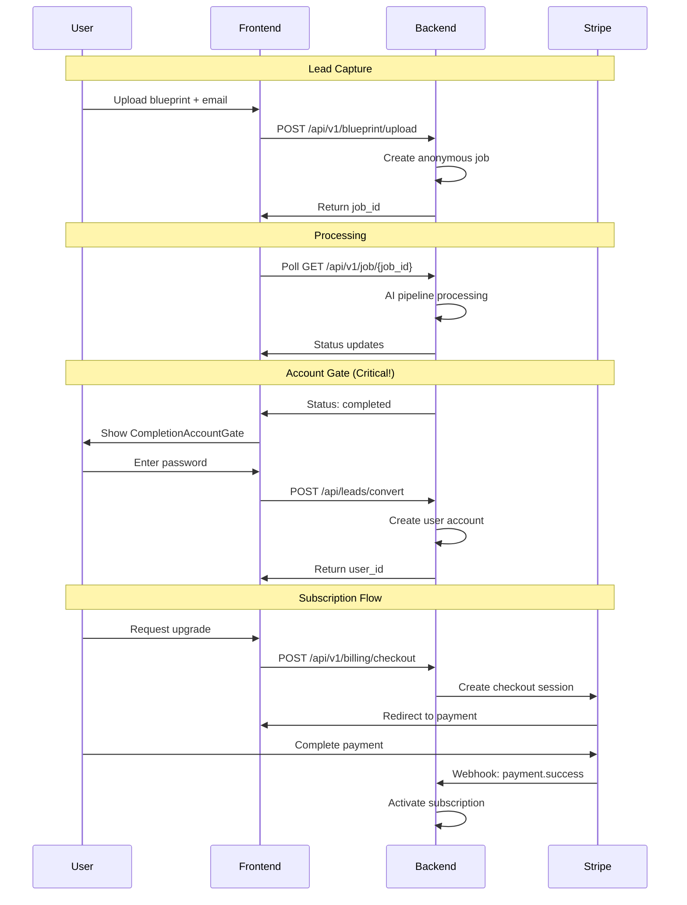

# AutoHVAC Backend Architecture

A production-ready FastAPI backend powering AI-driven HVAC load calculations with freemium SaaS business model.

## 🏗️ System Overview

AutoHVAC Backend is a comprehensive API service that:
- **Processes blueprints** using AI-powered Manual J calculations
- **Manages freemium user lifecycle** from lead capture to subscription
- **Handles secure authentication** with JWT tokens and password management
- **Integrates Stripe billing** for subscription management
- **Provides robust job processing** with PostgreSQL persistence and Redis caching

## 🚀 Core Features

### 💡 AI-Powered Blueprint Processing
- **GPT-4V Vision Analysis** - Intelligent room detection and layout understanding
- **Multi-extractor Pipeline** - Vision, vector, OCR, and scale detection running in parallel
- **ACCA Manual J Compliance** - Professional-grade load calculations
- **Real-time Progress Tracking** - WebSocket-style job status updates

### 👥 Freemium Business Model
- **Lead Capture** - Email-only blueprint processing 
- **Account Gate** - Convert at peak engagement (analysis completion)
- **User Conversion** - Seamless lead-to-user account creation
- **Subscription Management** - Stripe-powered billing and upgrades

### 🔐 Enterprise Security
- **JWT Authentication** - Stateless token-based auth with NextAuth integration
- **Password Security** - Salted SHA256 hashing with secure validation
- **Rate Limiting** - API abuse prevention
- **Audit Logging** - Comprehensive user action tracking

## 📁 Directory Structure

```
backend/
├── app/                     # FastAPI application
│   ├── main.py             # FastAPI app initialization and middleware
│   ├── database.py         # SQLModel database configuration
│   ├── models/             # Database models and schemas
│   │   ├── user.py         # User, Job, and business logic models
│   │   └── schemas.py      # Pydantic request/response schemas
│   ├── routes/             # API route handlers
│   │   ├── blueprint.py    # Blueprint upload and processing
│   │   ├── job.py          # Job management and status
│   │   ├── leads.py        # Lead capture and conversion
│   │   ├── auth.py         # Authentication and user management
│   │   ├── billing.py      # Stripe subscription management
│   │   └── admin.py        # Admin dashboard and analytics
│   ├── services/           # Business logic services
│   │   ├── job_storage.py  # PostgreSQL + Redis job persistence
│   │   ├── s3_storage.py   # AWS S3 file storage
│   │   └── user_service.py # User management utilities
│   └── core/               # Core configuration
│       └── stripe_config.py # Stripe payment configuration
├── domain/                 # Manual J calculation engine
│   ├── core/               # Core HVAC calculation logic
│   ├── models/             # HVAC domain models
│   ├── calculations/       # Manual J implementation
│   └── stages/             # Processing stage orchestration
├── infrastructure/         # AI processing infrastructure
│   ├── extractors/         # Blueprint analysis extractors
│   └── utils/              # Shared utilities
├── services/               # Legacy services (being phased out)
└── tests/                  # Comprehensive test suite
```

## 🛠 API Routes

### 🔵 Blueprint Processing (`/api/v1/blueprint/`)

#### `POST /upload`
**Purpose**: Upload and process blueprint files
**Auth**: Optional (email capture for anonymous users)
**Flow**: File upload → Job creation → Background processing → Status updates
**Returns**: Job ID for tracking progress

#### `GET /jobs/{job_id}`
**Purpose**: Get comprehensive job status and results
**Auth**: Optional (public jobs accessible, private jobs require auth)
**Returns**: Job metadata, processing status, and calculated results

#### `GET /jobs/{job_id}/result`
**Purpose**: Download detailed PDF report
**Auth**: Required for full reports (freemium gate)
**Returns**: Professional PDF with room-by-room load calculations

#### `GET /shared-report/{report_id}`
**Purpose**: Access shared reports via public links
**Auth**: None (public sharing functionality)
**Returns**: Read-only report view

#### `GET /users/{email}/can-upload`
**Purpose**: Check if user can upload (freemium enforcement)
**Auth**: None
**Returns**: Upload eligibility and subscription status

### 🔵 Job Management (`/api/v1/job/`)

#### `GET /list`
**Purpose**: List user's job history
**Auth**: Required
**Returns**: Paginated job list with metadata

#### `GET /{job_id}`
**Purpose**: Get specific job details
**Auth**: Required (must own job)
**Returns**: Job status, progress, and results

#### `GET /{job_id}/progress`
**Purpose**: Real-time job progress updates
**Auth**: Required
**Returns**: Processing stage, completion percentage, ETA

#### `DELETE /{job_id}`
**Purpose**: Delete job and associated files
**Auth**: Required (must own job)
**Returns**: Deletion confirmation

### 🔵 Lead Management (`/api/leads/`)

#### `POST /check`
**Purpose**: Check email status in system
**Auth**: None
**Flow**: Email validation → User lookup → Freemium status
**Returns**: User type (new/lead/user) and eligibility

#### `POST /capture`
**Purpose**: Capture email-only leads
**Auth**: None
**Flow**: Email validation → Lead creation → Marketing consent
**Returns**: Lead ID for tracking

#### `POST /convert`
**Purpose**: Convert lead to full user account
**Auth**: None (creates auth)
**Flow**: Email + password → User creation → Auto-login
**Returns**: User ID and account confirmation
**Critical**: This endpoint powers the freemium conversion flow

### 🔵 Authentication (`/auth/`)

#### `POST /login`
**Purpose**: Authenticate existing users
**Auth**: None (creates session)
**Flow**: Email + password validation → JWT token generation
**Returns**: Access token and user profile
**Integration**: NextAuth credentials provider

#### `GET /user/{user_id}`
**Purpose**: Get user profile by ID
**Auth**: Required
**Returns**: User profile data for session management

### 🔵 Billing (`/api/v1/billing/`)

#### `POST /checkout`
**Purpose**: Create Stripe checkout session
**Auth**: Required
**Flow**: Plan selection → Customer creation → Stripe session
**Returns**: Checkout URL for payment

#### `POST /billing-portal`
**Purpose**: Generate Stripe customer portal session
**Auth**: Required
**Flow**: Customer lookup → Portal session creation
**Returns**: Portal URL for self-service billing

#### `GET /subscription-status`
**Purpose**: Get current subscription details
**Auth**: Required
**Returns**: Subscription status, billing dates, feature access

#### `POST /webhook`
**Purpose**: Handle Stripe webhook events
**Auth**: Stripe signature verification
**Flow**: Event validation → Subscription updates → User notification
**Events**: Payment success, subscription cancellation, failures

### 🔵 Admin (`/api/admin/`)

#### `GET /`
**Purpose**: Admin dashboard interface
**Auth**: Admin only
**Returns**: HTML dashboard with analytics

#### `GET /analytics`
**Purpose**: Business analytics and metrics
**Auth**: Admin only
**Returns**: User counts, revenue metrics, conversion rates

#### `GET /users/search`
**Purpose**: Search and manage users
**Auth**: Admin only
**Returns**: User search results with management actions

## 💾 Database Architecture

### Core Models

#### `UserModel`
**Purpose**: Central user management with freemium business logic
**Key Fields**:
- `email` - Unique identifier and login
- `free_report_used` - Freemium gate enforcement
- `subscription_status` - Billing state (none/active/canceled/expired)
- `stripe_customer_id` - Billing integration
- `device_fingerprint` - Anti-fraud tracking

#### `JobModel`
**Purpose**: Blueprint processing job with comprehensive audit trail
**Key Fields**:
- `job_id` - Unique UUID for tracking
- `user_email` - Owner (supports anonymous jobs)
- `status` - Processing state (pending/processing/completed/failed)
- `job_data` - JSON blob with analysis results
- `processing_metrics` - Performance tracking
- `business_metadata` - Revenue attribution

#### `JobLogEntry`
**Purpose**: Detailed processing audit trail
**Key Fields**:
- `job_id` - Parent job reference
- `stage` - Processing stage name
- `level` - Log level (info/warning/error)
- `message` - Human-readable description
- `log_metadata` - Structured data

### Storage Strategy

#### PostgreSQL (Primary)
- **Jobs**: Full persistence with JSON flexibility
- **Users**: Comprehensive profile and subscription data
- **Audit Logs**: Complete processing history
- **Benefits**: ACID compliance, complex queries, data integrity

#### Redis (Cache Layer)
- **Job Status**: Real-time updates for active jobs
- **Session Data**: Fast session lookups
- **Rate Limiting**: API abuse prevention
- **Benefits**: Sub-millisecond access, automatic expiration

#### AWS S3 (File Storage)
- **Blueprints**: Original uploaded files
- **Reports**: Generated PDF reports
- **Processing Artifacts**: Intermediate analysis results
- **Benefits**: Scalable, reliable, cost-effective

## 🔄 Business Logic Flows

### Freemium Conversion Pipeline



### Job Processing Lifecycle

1. **Upload** (`blueprint.py:upload`)
   - File validation and storage
   - User eligibility check (freemium enforcement)
   - Job creation with metadata
   - Background processing trigger

2. **Processing** (AI Pipeline)
   - Page classification and filtering
   - Parallel extraction (vision, vector, OCR, scale)
   - Manual J calculations
   - Result validation and quality scoring

3. **Completion** (`job_storage.py`)
   - PostgreSQL persistence
   - Redis cache update
   - User notification
   - PDF report generation

### Authentication Flow

1. **Lead State** (Email Only)
   - Can upload and process blueprints
   - No persistent session
   - Account gate at analysis completion

2. **User State** (Email + Password)
   - Full account with dashboard access
   - JWT-based sessions via NextAuth
   - Can save and retrieve all reports

3. **Subscriber State** (Paying User)
   - Unlimited blueprint processing
   - Premium features and support
   - Billing portal access

## ⚙️ Configuration

### Required Environment Variables

```bash
# Core API
OPENAI_API_KEY=sk-...              # GPT-4V for blueprint analysis
DATABASE_URL=postgresql://...       # Primary database
REDIS_URL=redis://...               # Cache layer (optional)

# AWS Storage
AWS_ACCESS_KEY_ID=AKIA...          # S3 file storage
AWS_SECRET_ACCESS_KEY=...          # S3 credentials
AWS_REGION=us-east-1               # S3 region
S3_BUCKET_NAME=autohvac-files      # File storage bucket

# Stripe Billing
STRIPE_SECRET_KEY=sk_live_...      # Payment processing
STRIPE_WEBHOOK_SECRET=whsec_...    # Webhook verification
STRIPE_PRICE_ID=price_...          # Subscription plan ID

# Security
JWT_SECRET_KEY=your-secret-key     # Token signing
ALLOWED_ORIGINS=https://autohvac.ai # CORS configuration
```

### Optional Configuration

```bash
# Processing Limits
MAX_FILE_SIZE_MB=50                # Upload size limit
JOB_TIMEOUT_MINUTES=10             # Processing timeout
MAX_PAGES_PER_PDF=20               # PDF page limit

# Business Rules
FREE_REPORTS_PER_EMAIL=1           # Freemium limit
RATE_LIMIT_PER_MINUTE=10           # API rate limiting

# Development
DEBUG=true                         # Enable debug logging
ENABLE_PADDLE_OCR=true             # Enhanced OCR processing
```

## 🧪 Testing

### Run Test Suite

```bash
# Full test suite
python -m pytest tests/ -v

# Specific test categories
python -m pytest tests/test_pipeline_v3.py    # AI pipeline
python -m pytest tests/validation/            # Manual J calculations
python -m pytest tests/test_both_examples.py  # End-to-end
```

### Manual Testing

```bash
# Test blueprint processing
curl -X POST "http://localhost:8001/api/v1/blueprint/upload" \
  -F "file=@test_blueprint.pdf" \
  -F "email=test@example.com" \
  -F "zip_code=99006"

# Test lead conversion
curl -X POST "http://localhost:8001/api/leads/convert" \
  -H "Content-Type: application/json" \
  -d '{"email":"test@example.com","password":"password123"}'

# Test authentication
curl -X POST "http://localhost:8001/auth/login" \
  -H "Content-Type: application/json" \
  -d '{"email":"test@example.com","password":"password123"}'
```

## 🚀 Deployment

### Production Stack
- **Runtime**: Python 3.9+ with FastAPI
- **Database**: PostgreSQL 13+ (managed)
- **Cache**: Redis 6+ (managed)
- **Storage**: AWS S3
- **Hosting**: Render.com with auto-deploy

### Docker Development

```bash
# Build and run
docker build -f Dockerfile.dev -t autohvac-backend .
docker run -p 8001:8001 autohvac-backend

# With environment file
docker run --env-file .env -p 8001:8001 autohvac-backend
```

### Health Checks

```bash
# API health
curl http://localhost:8001/health

# Database connectivity
curl http://localhost:8001/api/admin/analytics

# Processing capability
curl -X POST http://localhost:8001/api/v1/blueprint/upload -F "file=@test.pdf"
```

## 📊 Monitoring & Observability

### Key Metrics
- **Conversion Rate**: Leads → Users → Subscribers
- **Processing Success Rate**: Successful AI analyses
- **API Response Times**: Performance monitoring
- **Error Rates**: Failure analysis and debugging

### Logging Strategy
- **Request Logging**: All API calls with timing
- **Processing Logging**: Detailed AI pipeline stages
- **Business Events**: User conversions, subscriptions
- **Error Tracking**: Comprehensive failure analysis

### Business Intelligence
- **User Analytics**: Signup trends, usage patterns
- **Revenue Metrics**: MRR, churn, LTV calculations
- **Product Metrics**: Feature usage, performance
- **Operational Metrics**: System health, costs

## 🔧 Development

### Local Setup

```bash
# Install dependencies
pip install -r requirements.txt

# Set up database
export DATABASE_URL="sqlite:///./app.db"
python -c "from app.database import create_db_and_tables; create_db_and_tables()"

# Run development server
uvicorn app.main:app --host 0.0.0.0 --port 8001 --reload
```

### Code Organization
- **Routes**: Thin controllers, delegate to services
- **Services**: Business logic, external integrations
- **Models**: Database schema and validation
- **Domain**: HVAC calculation engine
- **Infrastructure**: AI processing pipeline

### Performance Optimization
- **Database Indexing**: Strategic indexes on query patterns
- **Caching Strategy**: Redis for frequently accessed data
- **Connection Pooling**: Efficient database connections
- **Background Jobs**: Async processing for heavy operations

---

**AutoHVAC Backend** - Production-ready FastAPI service powering the next generation of HVAC load calculations. Built for scale, optimized for conversion. 🚀
