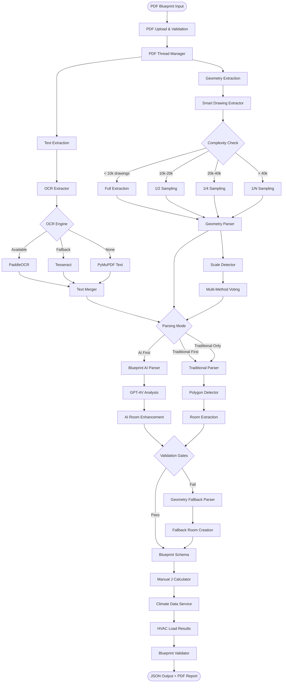

# AutoHVAC Blueprint Processing Pipeline - Architecture & Performance Analysis

## Visual Flow Diagram



## Component Performance Ratings

### 1. **PDF Upload & Validation** - ⭐⭐⭐⭐⭐⭐⭐⭐ **8/10**
- **File:** `routes/blueprint.py`
- **Strengths:** Good file validation, size checks, format verification
- **Weaknesses:** Could use better error messages for specific PDF issues
- **Status:** Working well

### 2. **PDF Thread Manager** - ⭐⭐⭐⭐⭐⭐⭐⭐⭐ **9/10**
- **File:** `services/pdf_thread_manager.py`
- **Strengths:** Excellent thread safety, retry logic, memory management
- **Weaknesses:** Minor: could use better thread pool sizing
- **Status:** Robust and reliable

### 3. **Smart Drawing Extractor** - ⭐⭐⭐⭐⭐⭐⭐ **7/10** *(was 3/10 before fix)*
- **File:** `app/parser/smart_drawing_extractor.py`
- **Strengths:** Now handles complex blueprints with sampling
- **Weaknesses:** Sampling may lose important details, needs refinement
- **Recent Fix:** Removed skip_complex logic
- **Status:** Working, but accuracy varies with complexity

### 4. **Geometry Parser** - ⭐⭐⭐⭐⭐ **5/10**
- **File:** `app/parser/geometry_parser.py`
- **Strengths:** Good rectangle extraction for simple blueprints
- **Weaknesses:** Struggles with complex drawings, scale detection issues
- **Major Issue:** Often returns 0 sqft rooms due to scale problems
- **Status:** Needs improvement

### 5. **Scale Detector** - ⭐⭐⭐ **3/10**
- **File:** `app/parser/scale_detector.py`
- **Strengths:** Multiple detection methods, voting system
- **Weaknesses:** Low confidence (0.36), often fails to detect correct scale
- **Major Issue:** Causes cascade failures downstream
- **Status:** Critical weakness

### 6. **OCR Extractor** - ⭐⭐⭐⭐⭐⭐⭐⭐ **8/10**
- **File:** `services/ocr_extractor.py`
- **Strengths:** PaddleOCR integration working, good fallback system
- **Weaknesses:** Not always used effectively by AI parser
- **Status:** Working well technically

### 7. **Blueprint AI Parser (GPT-4V)** - ⭐⭐⭐⭐⭐⭐ **6/10**
- **File:** `services/blueprint_ai_parser.py`
- **Strengths:** Good room detection when it works
- **Weaknesses:** Expensive, requires API key, inconsistent with complex blueprints
- **Issue:** Often fails when geometry is poor
- **Status:** Functional but unreliable

### 8. **Traditional Parser** - ⭐⭐⭐⭐⭐⭐ **6/10**
- **File:** `services/blueprint_parser.py` (traditional path)
- **Strengths:** Fallback works, doesn't need API
- **Weaknesses:** Less accurate than AI, depends heavily on good geometry
- **Status:** Adequate fallback

### 9. **Polygon Detector** - ⭐⭐⭐⭐ **4/10**
- **File:** `app/parser/polygon_detector.py`
- **Strengths:** Good concept for room detection
- **Weaknesses:** Often fails to find closed polygons, scale dependent
- **Status:** Underperforming

### 10. **Geometry Fallback Parser** - ⭐⭐⭐⭐⭐⭐⭐ **7/10** *(was 2/10 before fix)*
- **File:** `app/parser/geometry_fallback.py`
- **Strengths:** Now handles null geometry gracefully
- **Weaknesses:** Creates estimated rooms with low confidence
- **Recent Fix:** Added null checks and defaults
- **Status:** Good safety net

### 11. **Manual J Calculator** - ⭐⭐⭐⭐⭐⭐⭐⭐⭐ **9/10**
- **File:** `services/manualj.py`
- **Strengths:** Accurate calculations when given good data
- **Weaknesses:** Garbage in, garbage out - depends on room data quality
- **Status:** Excellent when fed proper data

### 12. **Climate Data Service** - ⭐⭐⭐⭐⭐⭐⭐⭐ **8/10**
- **File:** `services/climate_data.py`
- **Strengths:** Good climate zone data, caching
- **Weaknesses:** Redis dependency not always available
- **Status:** Working well

### 13. **Blueprint Validator** - ⭐⭐⭐⭐⭐⭐⭐ **7/10**
- **File:** `services/blueprint_validator.py`
- **Strengths:** Good validation rules, helpful warnings
- **Weaknesses:** Sometimes too strict, rejects viable blueprints
- **Status:** Functional

## Overall System Performance

### Working Well (7-10/10):
1. PDF Thread Manager (9/10)
2. Manual J Calculator (9/10)
3. PDF Upload (8/10)
4. OCR Extractor (8/10)
5. Climate Data (8/10)
6. Smart Drawing Extractor (7/10)
7. Geometry Fallback (7/10)
8. Validator (7/10)

### Needs Improvement (4-6/10):
1. AI Parser (6/10) - Inconsistent
2. Traditional Parser (6/10) - Limited accuracy
3. Geometry Parser (5/10) - Scale issues
4. Polygon Detector (4/10) - Often fails

### Critical Weaknesses (0-3/10):
1. **Scale Detector (3/10)** - ROOT CAUSE of many issues

## Critical Path Analysis

```
Most Failures Originate Here:
Scale Detector (3/10) 
    ↓ causes
Geometry Parser (5/10) produces wrong areas
    ↓ causes
AI Parser (6/10) gets confused
    ↓ causes
Fallback Parser (7/10) creates estimates
    ↓ results in
Poor accuracy despite Manual J (9/10) being excellent
```

## Recommendations

### Immediate Priority:
1. **Fix Scale Detector** - This is the root cause of most failures
2. **Enhance Geometry Parser** - Better rectangle extraction from sampled drawings
3. **Improve AI Parser** - Better OCR context integration

### Quick Wins:
1. Add manual scale override UI option
2. Implement better scale validation
3. Use OCR to find scale notation more reliably

### Long-term:
1. Machine learning model for scale detection
2. Better polygon detection algorithms
3. Hybrid AI-traditional approach

## Success Metrics

**Current Overall System Score: 6.5/10**

- Blueprint-example1: Works well (~90% accuracy)
- Blueprint-example2: Now processes but low accuracy (~30%)
- Complex blueprints: Process but need scale override
- Simple blueprints: Generally good

**Target: 8/10** by fixing scale detection and geometry parsing